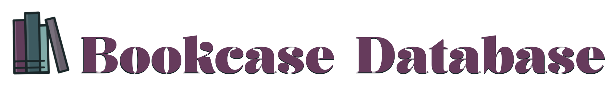
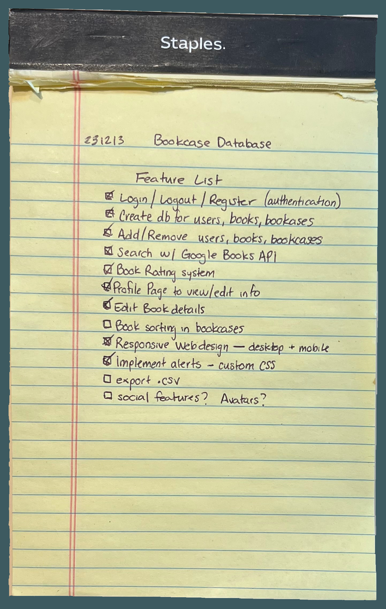
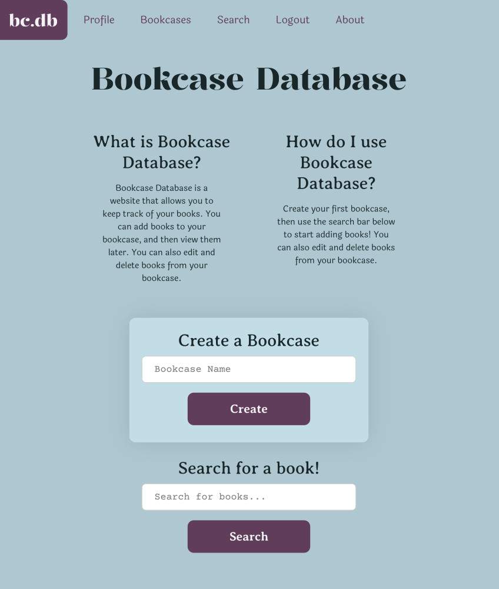

# Bookcase Database - CS50x Final Project

## What is Bookcase Database?
Bookcase Database is a simple web application that allows you to 
create virtual bookcases to store information about your books. 
You can add books to your bookcases manually or search for books
using the Google Books API. You can also edit the information about the
books, including ratings and notes.

## What did I learn while working on this project?

### Preface
Well, quite a lot. Coming into this project, I was about three months into
my journey learning to code. I had completed the CS50x course, except for the
final project. I had a bunch of ideas for final projects, but I wasn't quite sure where to start. I decided to take the CS50 Python and CS50 
SQL courses to expand on the knowledge I gained from CS50x. While completing the CS50 curriculum, I was also working my way through the Odin Project
Foundations. I completed Foundations right before I started working on 
Bookcase Database.

My initial idea for Bookcase Database was to create a web application where
users could upload an image of a bookshelf from real life and my app would 
analyze the image, create a virtual bookcase, and automatically add all of
the books from the photograph alone. I quickly realized that this was way beyond my
current skill level. I decided to scale back my idea and create a simple web
application that would allow users to create virtual bookcases and add books.
Stepping into the world of AI and machine learning is something I would like to
do in the near future. So, I intend to revisit my original idea, updating this
app or creating a new app entirely.

### My Process
#### (FULL process <a href="design/process/process.html">here</a>)

I started by jotting down a list of the features I wanted to include in my
app. 

  
<i>Feature List</i>

  <b></b>

I wanted to try to stay organized and I had heard of trello boards. I learned
what those were and how to use them, then I used my own trello board to keep track of the entire process. Finally. I gave ChatGPT access to the trello board, then sat back and watched my app come to life.

Just kidding.

Anyway, if you're actually interested in the process I took to create this app, there's a brief summary below. I've kept fairly 
detailed notes of each step and the things I've learned along the way. So if you're interested in reading about any of that, here is a full version of the <a href="design/process/process.html">entire process</a>.

#### Summary of the steps I took to create Bookcase Database
- Create a Trello board to keep track of the entire process
- Create a list of the features I wanted to include in my app
- Create a few mockups of what I wanted the app to look like
- Create a GitHub repository to store the code for my app
- Create a virtual environment using `venv`
- Install packages using `pip`
- Learn more about git and GitHub's uses and features

- Think about the file structure of the app, then create the files and folders
- Create a Flask app
- Create a SQLite database
- Create a SQLAlchemy model
- Create all the templates for the app
- Create the auth Blueprint and all its routes
- Create the views Blueprint and all its routes
- Design the database schema and create the models.py file to store the models
- Once the website is working, add CSS to make it all look nice
- Testing and troubleshooting woes 

- Deploy the app using PythonAnywhere
- Testing and troubleshooting woes continued...
- Create this README file to document the entire process

## And here's a screenshot of my homepage! 

## CREDITS
- Special thanks to the CS50 staff for creating the CS50x course and the CS50 Python and CS50 SQL courses.
- Special thanks to the Odin Project for creating the Foundations curriculum.
- Special thanks to the Flask team for creating the Flask framework and <a href="https://www.youtube.com/@TechWithTim">@TechWithTim</a> for finally helping me
    understand how to use it.
- Special thanks to <a href="https://codepen.io/BrandonGuerra">Brandon Guerra</a> for creating an awesome star rating system 
  with CSS that I used in this app.